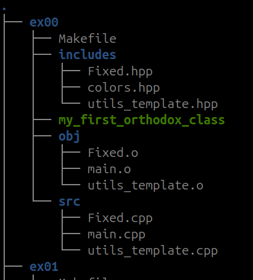

  

## 🚀 SYNOPSIS

This repo is a collection of ten C++ submodules.

Throughout `cpp_42`, we delve into the core concepts of classes, inheritance, polymorphism, and encapsulation, mastering how to structure and organize code efficiently in C++.

Each submodule presents unique challenges that prompt students to apply these principles in diverse and innovative ways.

The project goes beyond mere syntax and semantics, encouraging students to embrace the philosophy of OOP. They engage in developing robust, reusable, and maintainable code, which serves as the cornerstone for large-scale software development.

In addition to technical prowess, `cpp_42` emphasizes the importance of design patterns and best practices in software engineering.

`cpp_42` serves as a gateway to the profound realms of C++ and Object-Oriented Programming, equipping students with the tools and knowledge to create sophisticated software systems.

## 🛠️ REPO SPECIFICITIES AND CONSIDERATIONS

| Module | Brief |
|:--------:|:---------:|
|||
| [cpp_00](https://github.com/maitreverge/cpp_42/tree/master/cpp_00)| This first C++ module is designed to help you understand the specific features of C++ compared with compared with C. This is our first contact with object oriented programming.  |
| [cpp_01](https://github.com/maitreverge/cpp_42/tree/master/cpp_01)| This in-depth C++ module focuses on memory allocation, references, pointers to members and switch usage. |
| [cpp_02](https://github.com/maitreverge/cpp_42/tree/master/cpp_02)| This in-depth C++ module explores ad-hoc polymorphism, function overloading and orthodox canonical classes. |
| [cpp_03](https://github.com/maitreverge/cpp_42/tree/master/cpp_03)| This individual assignment aims to deepen the understanding of inheritance in C++. |
| [cpp_04](https://github.com/maitreverge/cpp_42/tree/master/cpp_04)| This in-depth C++ module explores subtype polymorphism, abstract classes and interfaces. |
|||
| [cpp_05](https://github.com/maitreverge/cpp_42/tree/master/cpp_05)| This in-depth C++ module focuses on Try/Catch functions and exception handling. |
| [cpp_06](https://github.com/maitreverge/cpp_42/tree/master/cpp_06)| This specialised C++ module explores the various types of cast available. |
| [cpp_07](https://github.com/maitreverge/cpp_42/tree/master/cpp_07)| This specialist C++ module focuses on understanding templates. |
| [cpp_08](https://github.com/maitreverge/cpp_42/tree/master/cpp_08)| This specialised C++ module focuses on understanding template containers, itterators and algorithms. |
| [cpp_09](https://github.com/maitreverge/cpp_42/tree/master/cpp_09)| This module focuses on familiarising students with the standard C++ containers in C++. |

## ⚙️ USAGE

Each sub-module is built in the same way :

  

- A **includes** folder in which you'll find `.hpp` files.
- A **src** folder which contains source code in `.cpp`, including a `main.cpp`.
- A **obj** folder, which contains pre-compiled objects files.
- A **Makefile** with the rules `all`, `clean`, `fclean` and `re`.

> [!NOTE]
> All exercices compiles with `c++` compiler, and at least `-Wall, -Wextra, -Werror` flags.
> 
> Some modules also includes `-Wshadow` and `-Wno-reorder` flags.

> [!IMPORTANT]
> In many sub-modules, you'll find files like `colors.hpp` or `utils_template.cpp/.hpp`.
> 
> Those files are mostly wrappers functions and ANSI colors for better code readibility.

## 🤝 CONTRIBUTION
Contributions are open, open a Github Issue or submit a PR 🚀
